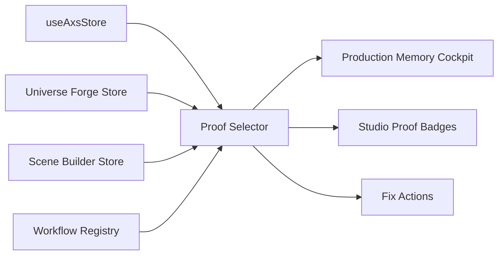

# AXS Proof Layer V2 Design

## Purpose

AXS needs to feel powerful because it proves its memory is working, not because it says it is. Proof Layer V2 upgrades the existing Production Memory rail into a live trust cockpit across the app. It shows whether the active project is ready for consistent character generation, universe continuity, correct workflow routing, brand voice usage, and launch distribution.

Universe Forge remains the flagship Living Character Universe Engine. Proof Layer V2 does not simplify or replace it. It makes Universe Forge more authoritative by surfacing its continuity memory everywhere else.

## Goals

- Make the platform's biggest claims visible and measurable inside the product.
- Keep proof deterministic and local for this phase.
- Give every warning a clear explanation and a fix action.
- Make the system ready for a future agentic command layer.
- Preserve the premium cinematic AXS design language.

## Non-Goals

- No new ML service or backend dependency in this phase.
- No real face-embedding audit yet.
- No external platform API verification yet.
- No redesign of Universe Forge, Scene Builder, Image Forge, or Video Forge.
- No autonomous multi-step agent execution yet.

## Proof Categories

The shared proof model continues to use five categories:

- `identity`: active character, DNA lock, FaceLock, body lock, reference readiness.
- `continuity`: Universe timeline, lore, relationship, wardrobe, emotional state, and Director's Cut readiness.
- `workflow`: active model, workflow profile, GPU fit, endpoint configuration, ComfyUI/RunPod readiness.
- `brandVoice`: Creator Hub training state and whether the current workflow is using trained voice.
- `distribution`: platform readiness, content rating, adaptation status, scheduling readiness.

Each category exposes:

- score from `0` to `100`
- status: `ready`, `watch`, or `blocked`
- signals explaining the result
- optional fix actions

## Production Memory Cockpit

The current draggable/minimizable rail becomes the primary proof cockpit.

Compact mode shows:

- active universe
- active character DNA
- global proof score
- warning count

Expanded mode shows:

- global proof score
- category chips
- highest-priority warnings
- quick controls for workflow mode, content rating, and reading mode

The detail drawer shows:

- sorted proof signals, blocked first, watch second, ready last
- plain-language explanation for every signal
- category label and score
- one-click fix action when possible

## Fix Actions

Every proof action uses a small typed intent instead of hard-coded UI assumptions.

Supported v2 intents:

- `navigate`: switch to the correct app tab.
- `run-continuity-audit`: execute the Universe Forge continuity audit and route to Universe.
- `open-settings`: route to config/settings for endpoint or workflow setup.
- `open-dna-lock`: route to Character Studio or DNA Library.
- `open-brand-training`: route to Creator Hub.
- `prepare-distribution`: route to Distribute.

Actions are intentionally simple in v2. They prepare the app for future agentic automation without letting the app take destructive or surprising steps.

## Screen Integrations

### Universe Forge

Universe Forge header and Director's Cut panel show:

- continuity score
- story memory status
- relationship integrity
- Director's Cut readiness
- run audit action

Universe Forge remains the source of truth for timeline, lore, relationships, emotional arcs, and continuity warnings.

### Character Studio and DNA Library

Character surfaces show:

- DNA lock state
- anchor/reference status
- FaceLock/body lock readiness
- prompt memory status

Switching characters must continue clearing stale preview and reference state.

### Scene Builder, Image Forge, and Video Forge

Generation surfaces show:

- active workflow profile
- model fit
- endpoint readiness
- Character DNA/IP-Adapter readiness
- continuity status from Universe Forge

Blocked workflow state should not crash the UI. It should explain what setup is missing.

### Creator Hub, Scripts, Campaign, and Distribute

Business and launch surfaces show:

- brand voice trained/applied
- campaign readiness
- platform adaptation readiness
- content rating readiness
- scheduling gaps

## Data Flow

The proof selector reads existing app state from:

- `useAxsStore`
- `useUniverseForgeStore`
- `useSceneBuilderStore`
- workflow registry

The selector produces one `AxsProofSummary`. UI components consume the summary through a shared hook. The pure scoring module stays testable without React or Zustand.

## Error Handling

- Missing active character lowers identity score instead of throwing.
- Missing universe continuity checks produce watch/blocked signals.
- Unknown workflows fall back to a safe workflow status.
- Missing endpoints are explained as configuration issues.
- LocalStorage failures do not stop app boot.
- Proof drawer actions should close cleanly after routing or audit execution.

## Accessibility and UX

- Status uses both color and text.
- Action buttons have explicit labels.
- Compact mode remains draggable.
- The rail does not cover the main creative canvas on standard layouts.
- The proof detail drawer should be keyboard reachable and dismissible.

## Test Plan

Unit tests:

- full setup returns `ready`
- missing active character blocks identity
- continuity warning lowers continuity
- unknown/custom workflow does not crash
- missing required endpoint lowers workflow score
- fix intents are present for actionable blocked/watch signals

Manual checks:

- rail can be dragged while expanded
- rail can be dragged while minimized
- detail drawer opens and closes
- run continuity audit action works
- switching tabs preserves rail state
- SFW/NSFW mode does not break proof scoring
- white-page reading mode regression stays fixed

Verification commands:

- `npm run lint`
- `npm run test`
- `npm run build`
- `npm audit --json`

## Future V3 Hooks

Proof Layer V2 prepares these later upgrades without implementing them:

- real face-embedding audits
- ComfyUI output scoring
- live endpoint health checks
- platform API verification
- agentic command execution
- automatic repair plans

## Acceptance Criteria

- Production Memory feels like a live proof cockpit, not a passive sidebar.
- Every major studio shows relevant proof status.
- Every blocked/watch signal explains itself.
- Most warnings provide a direct fix action.
- Universe Forge remains the authoritative source of continuity memory.
- Tests and build pass.
